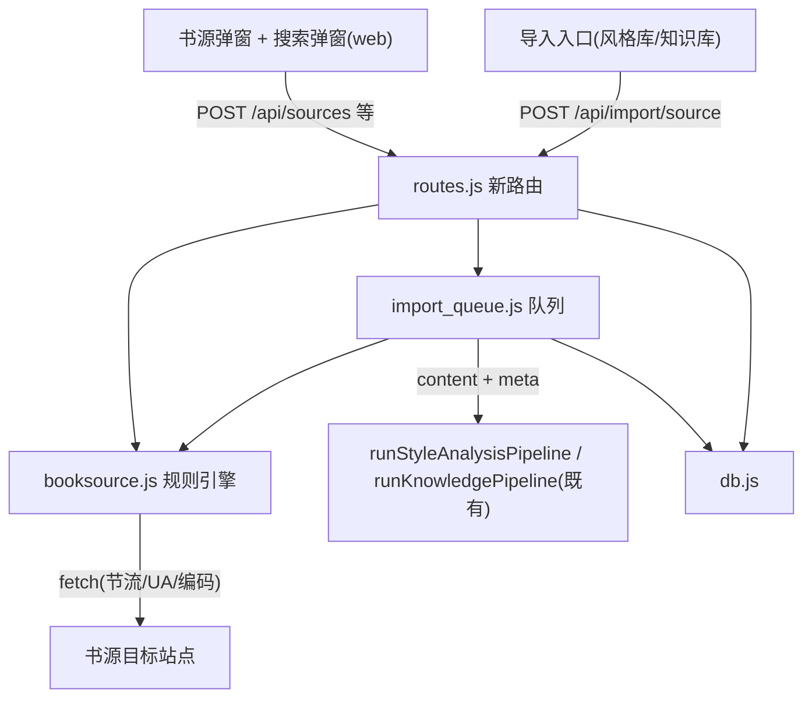

# 书源导入与搜索（booksource-import）

Feature Name: booksource-import
Updated: 2026-09-03

## Description

在「AI 小说工坊」内新增「书源导入与搜索」能力：用户粘贴 Legado（阅读 3.0）兼容的书源 JSON 完成导入与管理；搜索时系统向所有启用书源并发发起关键词搜索并合并结果（标注来源，重名书可辨）；用户选中某本书后整本全量入队——抓目录、逐章抓正文拼接，复用既有后台队列与分析管线（风格库 / 知识学习库）。解决番茄网页端仅开放前 10 章试读导致整本语料缺失的问题。

## Architecture



- 规则引擎 `server/src/booksource.js` 为核心新模块，负责书源校验、规则求值、搜索、目录、正文抓取
- 队列 `import_queue.js` 扩展分发：`source_type = 'fanqie' | 'booksource'`，booksource 分支调用规则引擎抓全书，后续管线与番茄完全一致
- 前端复用 `FanqieBatchBar.vue` 队列面板，新增书源管理与搜索两个弹窗

## Components and Interfaces

### 1. 规则引擎 `server/src/booksource.js`

导出：

- `parseSourceBatch(text) -> { items: ParsedSource[], errors: [{index, message}] }`
  - 宽松解析 JSON（对象或数组），逐条校验必填字段：`bookSourceUrl`、`searchUrl`、`ruleSearch`、`ruleToc`、`ruleContent`
  - 每条产出 `ParsedSource = { name, sourceUrl, searchUrl, rules, partial: string[] }`，`partial` 记录不支持的规则点（JS 引擎、XPath）
- `searchBook(source, keyword, fetchImpl) -> { results: SearchItem[] }`
  - `SearchItem = { name, author, latest, intro, bookUrl }`（依据 `ruleSearch` 的 bookList/name/author/latestChapter/intro/bookUrl/checkKeyUrl 等子规则求值）
- `fetchBookInfo(source, bookUrl, fetchImpl) -> { title, author, intro }`（ruleBookInfo，可选；搜索结果字段优先）
- `fetchToc(source, bookUrl, fetchImpl) -> Chapter[{ title, url }]`
  - ruleToc：`chapterList`（列表规则）+ `chapterName` + `chapterUrl`；支持 `nextTocUrl` 分页目录（上限 50 页防死循环）
- `fetchContent(source, chapterUrl, fetchImpl) -> string`
  - ruleContent：`content` 规则 + `nextContentUrl` 正文翻页（上限 50 页）；输出纯文本（去标签、实体解码、广告行按书源 `##` 净化）

规则求值子集（`evalRule(rule, ctx)`，ctx 为 cheerio 节点或 JSON 对象）：

| 语法 | 支持 | 实现 |
| --- | --- | --- |
| `@css:selector@attr` | 是 | cheerio 选择器 + 属性/text/html |
| 默认链式 `class.x@tag.y@text`、`id.a@href`、`tag.p.2@html`、`@all` | 是 | 转换为 CSS 选择器等价实现（class.x → `.x`，tag.y → 标签，索引取第 n 个） |
| `$.a.b` / `$.data.list[*].title` JSON 路径 | 是 | 手写简单路径求值（`.` 取键、`[*]`/`[n]` 索引展开） |
| `##正则##` / `##正则##替换##` 净化后缀 | 是 | 求值后字符串 replace |
| `||` 备选规则 | 是 | 前一条为空时取下一条 |
| `&&` 合并规则 | 是 | 结果按序拼接 |
| `<js>...</js>`、`{{java.xxx}}`、`@XPath:` | 否 | 导入时检测写入 `partial`，运行时求值为空 |

`searchUrl` 模板子集：

- `{{key}}` → `encodeURIComponent(keyword)`；`{{page}}`（本期恒为 1）
- 尾缀 `,{...}` JSON 选项：`method: POST`（body 模板同样替换 `{{key}}`）、`charset: gbk`（iconv-lite 请求体解码）、`headers` 附加
- 请求统一带浏览器 UA、15s 超时；站点间并发用 `Promise.allSettled`，同站点内逐章节流 250ms（复用 `fanqie.js` 的 `throttle` 模式）

### 2. 数据模型 `server/src/db.js`

新表 `book_sources`：

```sql
CREATE TABLE IF NOT EXISTS book_sources (
  id INTEGER PRIMARY KEY AUTOINCREMENT,
  name TEXT NOT NULL,                -- bookSourceName 或站点域名
  source_url TEXT NOT NULL UNIQUE,   -- bookSourceUrl，重复导入覆盖
  search_url TEXT NOT NULL,
  rules_json TEXT NOT NULL,          -- 其余规则整体 JSON 存储
  partial_json TEXT DEFAULT '[]',    -- 不支持规则点列表
  status TEXT DEFAULT 'enabled',     -- enabled | disabled
  created_at TEXT DEFAULT (datetime('now'))
);
```

`import_jobs` 迁移（`ensureColumn`）：

- `source_type TEXT DEFAULT 'fanqie'`
- `book_url TEXT DEFAULT ''`（booksource 任务的详情页 URL）

### 3. 队列 `server/src/import_queue.js`

- `enqueue` 增加 `sourceType`、`bookUrl` 参数；booksource 任务先 `fetchBookInfo`+`fetchToc` 拿书名/总章数，再逐章 `fetchContent`
- `executeJobInner` 按 `job.source_type` 分发；booksource 分支产出 `content` 与 `meta = { title, author, intro, genre }` 后，与番茄分支共用同一段分析管线调用代码
- 章节失败：跳过并计 `skipped_chapters`；连续 50 章失败视为站点失效，任务置 `failed`（message「目标站点连续失败，请检查书源可用性」）
- 取消/重试/恢复语义与番茄一致（恢复时 fetching 清缓存重抓）

### 4. 路由 `server/src/routes.js`

| 方法 | 路径 | 说明 |
| --- | --- | --- |
| POST | `/api/sources` | 导入书源 JSON 文本，返回成功/失败明细 |
| GET | `/api/sources` | 书源列表 |
| PATCH | `/api/sources/:id` | `{ status }` 启用/禁用 |
| DELETE | `/api/sources/:id` | 删除 |
| POST | `/api/sources/search` | `{ keyword }` 聚合搜索，返回 `{ results, failures }` |
| POST | `/api/import/source` | `{ sourceId, bookUrl, target, genre }` 入队（复用 import_jobs 响应格式） |

### 5. 前端 `web/src`

- `BookSourceDialog.vue`：书源管理弹窗——textarea 粘贴 JSON 导入（展示逐条成功/失败报告）、列表（名称/域名/状态开关/删除）
- `BookSearchDialog.vue`：搜索弹窗——关键词输入 → 聚合结果列表（书名、作者、来源书源 badge、简介）→ 选中后展示目标库选择（风格库/知识学习库，与番茄导入一致）→ 入队
- `StyleLibrary.vue` / `KnowledgeBase.vue`：导入区新增「书源搜索导入」与「管理书源」入口；复用 `FanqieBatchBar.vue` 展示队列进度（该组件与 target 解耦，无需改动）
- `api/index.js`：`importSources / listSources / updateSource / deleteSource / searchSources / importFromSource` 六个封装

## Data Models

- 搜索结果项：`{ sourceId, sourceName, name, author, latest, intro, bookUrl }`
- 导入任务：复用 `import_jobs` 全部字段；`title/author/genre` 取自书源搜索结果与详情页；`content` 存拼接后的全书正文
- 章节正文清洗管线：HTML 去标签 → 实体解码 → `##` 净化规则 → 连续空行折叠，与番茄正文出口格式一致（`\n` 分段）

## Correctness Properties

1. 同一批次导入中，单条书源校验失败不影响其他条目入库
2. 重复导入相同 `bookSourceUrl` 后，库内该书源恰有一条且为最新内容
3. 聚合搜索结果中每一条均可追溯到其来源书源（sourceId）
4. 任何单个书源搜索失败均不改变其他书源结果的完整性
5. booksource 任务与 fanqie 任务共享同一 `import_jobs` 状态机（pending→fetching→analyzing→done/failed/cancelled），取消与重试语义一致
6. 章节正文进入语料前必须通过净化管线（无残留 HTML 标签）

## Error Handling

| 场景 | 处理 |
| --- | --- |
| 书源 JSON 解析失败 | 返回第几条 + 解析错误 + 期望字段结构说明 |
| 书源缺必填字段 | 同上，跳过该条继续处理其余条目 |
| 书源含 JS/XPath 规则 | 保存并标记 partial，搜索/导入时按空值处理；搜索结果为空时错误信息提示「该书源使用了不支持的规则」 |
| 站点请求超时/非 200 | 搜索：该源计入 failures；导入：该章跳过计数，连续 50 章失败任务失败 |
| 正文翻页死循环 | nextContentUrl/nextTocUrl 上限 50 页 |
| 目标站编码非 UTF-8 | 按 searchUrl charset 声明用 iconv-lite 解码，未声明默认 UTF-8 |

## Test Strategy

- **规则引擎单测**（`server/test/booksource_rule.test.js`）：默认链式规则、@css、JSON 路径、`##` 净化、`||`/`&&`、searchUrl 模板（GET/POST/charset）、nextContentUrl 翻页、不支持类型标记
- **导入与搜索单测**（`server/test/booksource_api.test.js`）：mock fetch —— 批量导入部分失败、重复导入覆盖、聚合搜索部分源失败不阻塞、全失败汇总
- **队列集成测试**（扩展 `import_queue.test.js`）：booksource 任务 入队→目录→逐章正文（含失败章跳过）→done→content 入库；连续失败置 failed
- **fixture**：自建书源站 HTML 样例与 JSON API 样例（自造内容，避免依赖外部盗版站）
- **回归**：现有 79 例全量通过；前端 `npm run build` 通过
