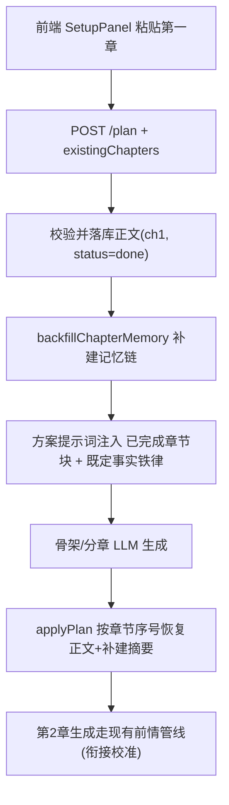

# 已有正文优先的规划生成（content-first-plan）

Feature Name: content-first-plan
Updated: 2026-09-27

## Description

在方案生成入口（POST /api/novels/:id/plan）新增可选参数 `existingChapters`，允许作者把已写好的第一章正文随方案请求提交。后端先落库正文并补建记忆链（摘要/角色状态/关键剧情事实/伏笔），再把"已完成章节"的摘要+关键事实+结尾片段注入方案生成提示词，并以既定事实铁律约束方案输出；`applyPlan` 按章节序号恢复已写正文（含补建摘要），方案重出/修订不再丢失正文。方案确认后第 2 章起走现有前情管线（上一章结尾 + 衔接校准），从实际正文自然续接。

## Architecture

## Components and Interfaces

### 1. 方案路由扩展（server/src/routes.js `POST /novels/:id/plan` ~2662）

- 新请求字段：`existingChapters?: Array<{ index?: number, title?: string, content: string }>`
- 校验：v1 仅取数组内 `index` 规整为 1 的项与未指定 index 的项（默认 1）；content trim 后 <200 字 → 400 `已有正文过短（至少 200 字）`。
- 落库：`INSERT OR REPLACE` chapters（novel_id, chapter_index=1, title || '第一章', content, word_count, status='done', summary 清空后由补建填充）。
- 补建：`await backfillChapterMemory(novel, config, send, 2)`（复用 round 38 机制：摘要+角色状态+关键事实+伏笔；失败不阻塞）。
- 提示词：构建 `existingChaptersBlock` 注入方案 userPrompt：
  - 每章：章节摘要（补建结果）、关键剧情事实、正文结尾（最后 600 字）
  - 既定事实铁律：已有正文中的人物/事件/设定为既定事实；人物表/世界观/势力/第 2 章起概要必须与之相容；第 1 章概要直接采用实际内容摘要。
- 无 `existingChapters` 时行为与现状完全一致（回归保障）。

### 2. applyPlan 按序号恢复（server/src/routes.js ~2474）

- 新 opts：`existingIndices?: number[]`（方案路由携带）。
- 快照已有（content != '' 的章节全量快照，含 summary/word_count/ai_score）。
- 恢复规则：对计划章节 i+1——
  - `existingIndices` 含 i+1：按序号强制恢复正文+word_count+ai_score+status='done'，概要优先用快照补建摘要；
  - 其余章节保持现有"标题+概要完全相同才恢复"的行为（方案修订兼容性不变）。
- 方案分章数少于已有正文覆盖章节数时：超出计划的多余已写章节在计划章节之后按序号追加恢复（status='done'）。
- 结果沿用 `preserved_chapters` 返回保留数。

### 3. 前端表单（web/src/components/SetupPanel.vue）

- planForm 新增 `existingChapterContent: ''`；方案表单新增可折叠"已有开头正文（可选）"文本域（el-input textarea，占位说明用途与 200 字下限）。
- `startPlan()`：内容非空且 <200 字 → `ElMessage.warning` 拦截；否则 `existingChapters: [{ index: 1, content }]` 随 generatePlan 提交。
- 生成成功后保留输入内容（便于重出方案）；方案 SSE 状态流自动展示补建进度（后端 send 已有"第 N 章缺少记忆摘要，已自动补建"提示）。

## Data Models

- chapters 表无 schema 变更：复用 content/summary/status/word_count/ai_score 字段；用户正文 status='done' 与 AI 生成章节一致。
- `existingChapters` 仅为请求参数，v1 取第 1 章入参，数据结构兼容未来多章。

## Correctness Properties

1. P1：`existingChapters` 缺省或为空数组时，方案路由生成的提示词与现状逐字节等价（不含已完成章节块）。
2. P2：带 `existingChapters` 生成方案并应用后，第 1 章 content === 用户提交正文（trim 后），status='done'，summary 非空（补建摘要）。
3. P3：方案提示词包含用户正文结尾片段（最后 600 字的可辨识子串）与"既定事实"铁律文本。
4. P4：带已写正文重出方案（再次 POST /plan 不带 existingChapters），第 1 章正文仍保留（existingIndices 从 DB 快照推导：content != '' 的章节序号自动纳入）。
5. P5：正文 <200 字时请求返回 400 且不落库。

## Error Handling

- 补建 LLM 调用失败：降级用正文末尾 600 字作为衔接依据继续方案生成（backfillChapterMemory 内部已 try/catch 不阻塞）。
- existingChapters 内容为空白/超短：400 拒绝，不产生部分落库。
- applyPlan 快照读取失败：维持现状（快照为空数组不阻塞方案应用）。

## Test Strategy

- 静态测试 test_round40.mjs：路由参数解析、校验阈值、既定事实铁律文本、applyPlan existingIndices 分支、前端字段与提交参数。
- E2E e2e_round40.mjs（mock66=4166）：plan+existingChapters 全流程——补建请求捕获（速记员/书记官/连贯性管理员）、方案请求含已完成章节块与实际正文结尾、applyPlan 后 ch1 正文保留且概要为补建摘要、生成 ch2 请求含 ch1 实际结尾片段；回归：不带 existingChapters 的 plan 流程行为不变。
- 全量回归：round7-39 静态 sweep + e2e 28/30/31/32/33/38/39 + manager_tool_auth。

## References

- server/src/routes.js:2662 — POST /novels/:id/plan
- server/src/routes.js:2474 — applyPlan（快照恢复现状）
- server/src/routes.js:324 — backfillChapterMemory（round 38 补建机制）
- server/src/routes.js:4434 — calibrateNextSummary（round 39 衔接校准）
- web/src/components/SetupPanel.vue:365 — startPlan()
