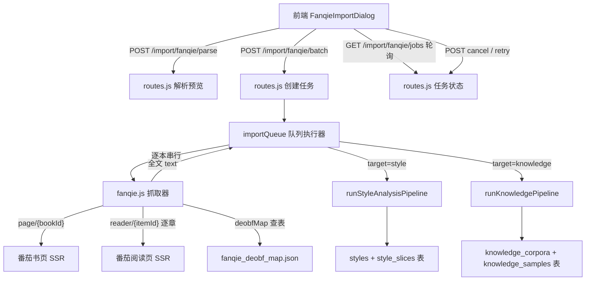

# 番茄小说批量导入

Feature Name: fanqie-batch-import
Updated: 2026-09-01

## Description

在「AI 小说工坊」内新增「从番茄批量导入」能力：用户一次粘贴多条番茄书籍链接（或书籍 ID），系统在后台队列中逐本抓取网页端可读章节正文、按内置映射表还原防爬混淆字符，然后自动复用既有的风格分析（含风格 DNA 与切片打标）或知识学习（全书切片与场景打标）管线，完成后直接进入风格库 / 知识学习库。全程持久化任务状态，支持取消、失败重试与服务重启恢复。

PoC 已验证的抓取链路（2026-09-01，实机验证通过）：

| 环节 | 接口 / 方法 | 结论 |
|---|---|---|
| 书籍目录 | `GET https://fanqienovel.com/page/{bookId}`，解析 `window.__INITIAL_STATE__.page` | 可用：书名/作者/简介/字数/全部章节（含 `isChapterLock`、`itemId`；番茄全免费，`needPay` 恒 0） |
| 章节正文 | `GET https://fanqienovel.com/reader/{itemId}`，解析 `__INITIAL_STATE__.reader.chapterData` | 可用：SSR 直出正文 HTML 与明文标题 |
| 正文混淆 | 高频字替换为私用区字符（U+E3E8 起），由自定义字体映射 | 字体 URL 全局固定（awesome-font/c/*.woff2），母字体为思源黑体，gid 序号可反查目标字 |
| 反混淆 | 内置映射表（362 条 code→char） | PoC 字形匹配准确率约 95%，两章实文还原通顺；实现阶段需做一次多字体投票修正 |
| 书名搜索 | `GET /api/author/search/search_book/v1` | 被风控返回空 body，不可用；导入入口采用粘贴链接 / 书籍 ID |

## Architecture



- 队列执行器为 Node 进程内单例，任务状态落 SQLite；服务启动时恢复未完成任务。
- 抓取与分析共用 `AbortController`，取消请求同时中断网络请求与 LLM 调用。
- 限速复用现有 `rate_limit.js`（LLM 侧）+ 抓取侧自建串行间隔。

## Components and Interfaces

### 1. `server/src/fanqie.js`（新建）

番茄站点抓取与反混淆，纯函数 + fetch，可单测。

```js
// 输入解析：支持 page/reader 链接、纯数字 bookId，多种分隔（换行/逗号/空格）
export function parseBookInputs(rawText) // -> [{ raw, bookId?, itemId?, error? }]

// 书页抓取：解析 __INITIAL_STATE__.page（括号配平提取 JSON）
export async function fetchBookMeta(bookId, { signal }) 
// -> { bookId, title, author, intro, wordCount, readableCount, lockedCount, chapters: [{ itemId, title, locked }] }

// 章节抓取：解析 reader.chapterData，正文去 img/占位符/HTML 标签 + 混淆还原
export async function fetchChapter(itemId, { signal })
// -> { itemId, title, content }

// 混淆还原：私用区字符查表；无法还原保留原字符
export function deobfuscate(text) // -> { text, unknownCount }

// 内置映射表加载（构建期产物，运行时只读）
import deobfMap from './data/fanqie_deobf_map.json' with { type: 'json' }
```

抓取策略：

- User-Agent / Referer 与 PoC 一致（Chrome 桌面 UA + 对应页面 Referer）
- 每章请求间隔 ≥250ms，失败重试 3 次（退避 1s/3s/9s）；空 body（风控特征）视为限流，退避后重试
- 连续 50 章失败判定为风控升级，任务失败并暂停队列 5 分钟

### 2. `server/src/import_queue.js`（新建）

后台队列执行器。

```js
export function enqueueFanqieBatch(items, { target, genre }) // -> jobs[]
export function getJobs()        // -> 进行中 + 最近任务列表
export function cancelAll()      // 停止当前 + 清空 pending
export function retryJob(id)
export function deleteJob(id)
export function resumeOnBoot()   // 服务启动恢复：fetching/analyzing 重置为 pending
```

- 同一时刻仅 1 个任务执行（互斥锁）。
- 执行序列：`pending → fetching（逐章抓取，更新 fetched_chapters）→ analyzing（复用管线，更新 progress/message）→ done | failed | cancelled`。
- `job.content` 全文落库；分析失败重试时若 `content` 已存在则跳过抓取阶段。
- 分析阶段透传 `onProgress/onStatus` 回调写入 `job.progress/job.message`，前端轮询读取。

### 3. `server/src/routes.js`（改造）

- 从 `POST /styles`（L4691）与 `POST /knowledge/import`（L5556）抽出分析主体为可复用异步函数，handler 与队列共用：

```js
async function runStyleAnalysisPipeline({ config, ctrl, name, notes, text, onProgress, onStatus })
// -> { styleId, sliceCount }

async function runKnowledgePipeline({ config, ctrl, title, genre, author, text, onProgress, onStatus })
// -> { corpusId }
```

- 两个 handler 内部改为 `startSSE` + 调用管线（行为不变），队列调用时传入写库的回调。
- 新增路由：

| 方法 | 路径 | 说明 |
|---|---|---|
| POST | `/import/fanqie/parse` | `{ inputs }` → 解析预览（书名/作者/字数/章节数/错误） |
| POST | `/import/fanqie/batch` | `{ items, target, genre }` → 创建任务并入队 |
| GET | `/import/fanqie/jobs` | 进行中 + 最近任务（含 progress/message/计数） |
| POST | `/import/fanqie/cancel` | 取消当前与剩余队列 |
| POST | `/import/fanqie/jobs/:id/retry` | 重试失败任务 |
| DELETE | `/import/fanqie/jobs/:id` | 删除任务记录 |

### 4. `server/src/data/fanqie_deobf_map.json`（新建数据文件）

- 构建期产物：`server/scripts/build_deobf_map.py`（由 PoC 脚本整理，下载混淆字体 → 思源黑体 gid 反查 + 多版本字形投票 → 输出 JSON）。
- 映射表内容形如 `{ "e3e8": "在", "e3e9": "主", ... }`（362 条）。
- 运行时只读加载；实现阶段先执行一次修正构建（PoC 版本约 95% 准确，少数错字如 `十/面`、`叉/又` 需通过多参考字体投票消除）。

### 5. `web/src/components/FanqieImportDialog.vue`（新建）

三步式弹窗：粘贴输入 → 解析预览（可移除失败项）→ 确认入队。

- Props：`target`（默认 `'style'` 或 `'knowledge'`，由入口决定）、`visible`
- 目标库切换控件 + 知识库题材选择（GENRES 复用）
- 队列面板：轮询 `GET /import/fanqie/jobs`（3s），展示状态徽标、章节进度（`fetched_chapters/total_chapters`）、阶段消息、取消 / 重试 / 删除按钮
- 完成/失败后 emit 刷新事件，父页面重新拉取列表

### 6. `web/src/views/StyleLibrary.vue` 与 `KnowledgeBase.vue`（改造）

- 导入弹窗增加「从番茄批量导入」入口按钮，打开 `FanqieImportDialog`
- 页面顶部展示进行中批次条（有运行中任务时显示进度与快捷取消）

### 7. `web/src/api/index.js`（扩展）

新增 `parseFanqieInputs`、`createFanqieBatch`、`getFanqieJobs`、`cancelFanqieJobs`、`retryFanqieJob`、`deleteFanqieJob` 六个封装（普通 JSON 接口，非 SSE）。

## Data Models

新增表 `import_jobs`：

```sql
CREATE TABLE IF NOT EXISTS import_jobs (
  id INTEGER PRIMARY KEY AUTOINCREMENT,
  book_id TEXT NOT NULL,
  title TEXT DEFAULT '',
  author TEXT DEFAULT '',
  genre TEXT DEFAULT '',
  target TEXT NOT NULL DEFAULT 'style',      -- 'style' | 'knowledge'
  status TEXT NOT NULL DEFAULT 'pending',    -- pending|fetching|analyzing|done|failed|cancelled
  progress INTEGER DEFAULT 0,                -- 0-100
  message TEXT DEFAULT '',
  total_chapters INTEGER DEFAULT 0,
  fetched_chapters INTEGER DEFAULT 0,
  skipped_chapters INTEGER DEFAULT 0,        -- 锁定/失败跳过
  deobf_unknown INTEGER DEFAULT 0,           -- 无法还原字符计数
  content TEXT DEFAULT '',                   -- 抓取全文（重试复用）
  result_ref TEXT DEFAULT '',                -- 完成后指向 styleId 或 corpusId
  error TEXT DEFAULT '',
  created_at TEXT DEFAULT (datetime('now','localtime')),
  updated_at TEXT DEFAULT (datetime('now','localtime'))
);
```

- 幂等：同一 `book_id` 存在 `pending|fetching|analyzing` 任务时，重复提交返回已有任务。
- `result_ref`：`style:12` 或 `knowledge:3`，前端据此跳转。

## Correctness Properties

1. **可读章节全覆盖**：网页端可读章节（`isChapterLock = false`）全部尝试抓取；锁定章节全部跳过并计入 `skipped_chapters`；正文短于 200 字的残片（锁定章节试读残片）丢弃不计入语料
2. **混淆还原完整性**：抓取正文中出现的全部私用区字符均能在映射表中命中；无法命中的保留原字符且计入 `deobf_unknown`；`deobf_unknown / 总字符 > 5%` 时任务失败（判定映射失效），乱码文本不进入目标库
3. **队列互斥**：任意时刻至多一个任务处于 `fetching|analyzing`
4. **任务幂等**：同一 bookId 重复提交不产生重复任务
5. **重启可恢复**：进程重启后 `fetching|analyzing` 任务回到 `pending`，`content` 非空时跳过抓取直接分析
6. **管线一致性**：批量导入产出的风格 / 知识库记录与手工导入完全同构（同一管线、同一表结构、同一打标流程）

## Error Handling

| 场景 | 处理 |
|---|---|
| 链接/ID 解析失败 | 预览条目标红并给出原因，可移除后继续 |
| 书页抓取失败 / 空 body | 重试 3 次（退避），仍失败则该任务 `failed`，队列继续 |
| 章节抓取失败 | 重试 3 次，仍失败跳过该章并计数；连续 50 章失败 → 任务失败 + 队列暂停 5 分钟 |
| 混淆映射失效 | 还原率低于 95% 时任务失败，提示「番茄更新了混淆方案，请更新映射表」 |
| LLM 分析失败 | 复用 `analyzeChunksRateLimited` 内部重试；全部块失败 → 任务 `failed`，`content` 保留供重试 |
| 无可用 LLM | 任务直接 `failed`，错误信息提示配置模型（离线模式下知识库可用离线统计，风格库必须 LLM） |
| 用户取消 | `AbortController` 同时中断抓取与 LLM；任务标记 `cancelled` |
| 目标站点不可达 | 任务失败并汇总错误；不阻塞后续任务（各自重试） |

## Test Strategy

1. **反混淆单测**（`server/test/fanqie_deobf.test.js`）
   - 用 PoC 保存的真实阅读页 HTML 作为 fixture，验证 `fetchChapter` 提取 + `deobfuscate` 还原后正文与已知明文关键句一致
   - 映射表覆盖测试：fixture 中全部私用区字符 ∈ 映射表 keys
2. **输入解析单测**：`parseBookInputs` 对 page 链接、reader 链接、纯数字、混合分隔、非法输入的处理
3. **书页解析单测**：用保存的书页 HTML fixture 验证 `fetchBookMeta`（书名/作者/章节数/isChapterLock 过滤）
4. **队列逻辑单测**（mock fetch）：串行互斥、失败跳过、取消中断、重启恢复、幂等提交
5. **管线一致性**：mock LLM 下队列产出的 styles / knowledge_corpora 记录与手工导入字段结构一致
6. **回归**：全量 `node --test` 保持通过（当前基线 50/50）

## References

[^1]: 番茄书页 SSR 结构（`__INITIAL_STATE__.page`）—— PoC 抓取样例 `/tmp/opencode/fq_page.html`
[^2]: 阅读页 SSR 结构（`__INITIAL_STATE__.reader.chapterData`）—— PoC 抓取样例 `/tmp/opencode/reader.html`、`reader2.html`
[^3]: 混淆字体样例 `https://lf6-awef.bytetos.com/obj/awesome-font/c/dc027189e0ba4cd.woff2`（全局固定，CFF 母字体 SourceHanSansSC）
[^4]: 思源黑体 release（用于映射构建）`https://github.com/adobe-fonts/source-han-sans/releases`
