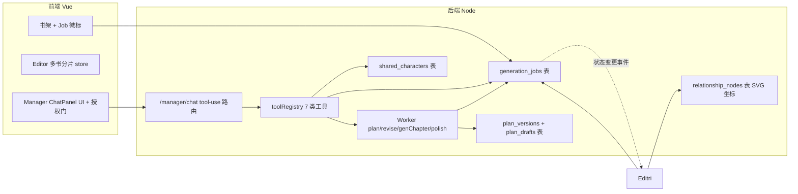

# Stability and Manager Rewrite

Feature Name: stability-and-manager-rewrite
Updated: 2026-08-06

## Description

把 AI 小说工坊从「单本串行 + 同步对话」升级到「多本并行 + 方案版本化 + 总管 AI tool-use + 跨书角色联动」的稳定形态，并根除「AI 返回格式异常」与「方案/角色/剧情记忆错乱丢失」两类顽疾。本轮为架构级大改，覆盖前后端与桌面打包。

## Architecture

本轮架构变更分层落地：

1. **数据层**：新增 9 张表持有 plan 版本/草稿/变更日志/Job/Manager 对话与记忆/关系节点坐标/共享角色。所有新表用 `CREATE TABLE IF NOT EXISTS` + `ensureColumn` 兼容旧库升级。
2. **Worker 层（后端 Job 表）**：plan/revise/generateChapter/polish/compress 各创建 Job 行，状态机独立于 SSE 连接，前端可断线/切书/刷新后恢复 Job 进度。
3. **Manager 层（后端 tool-use 路由）**：`/manager/chat` 用 OpenAI tools/function-calling 协议；后端 `toolRegistry` 定义 7 类工具的 schema 与 executor；写类工具经「待授权」状态落库 `pending_tool_calls`，前端授权门 UI 显式通过后才执行。
4. **前端状态分片**：`useEditorStore` 从单 novel 全局态改造为 `Map<novelId, stateSlice>`，切书仅切活跃 novelId + 读取 Job 表恢复；右栏 Manager store 独立。
5. **联动总线**：前端 `workspaceEventBus` 把 Worker Job 变更摘要注入 Manager 对话上下文（system 角色 `workspace_event`），让 Manager 感知 Worker。



## Components and Interfaces

### 后端新增/改动

- **db.js**：新增 9 张表 + 索引，沿用 `ensureColumn` 风格兼容。
- **server/src/jobs.js**（新增）：`createJob(novelId, stage, params)`、`updateJob(id, patch)`、`getJob(id)`、`listJobsByNovel(novelId)`、`listActiveJobs()`、`subscribeJobEvents()`。事件通过内存 pub/sub 推到 SSE 长连接，关掉前端时 Job 仍跑、表里有记录。
- **routes.js**：所有 plan/revise/generateChapter/polish/compress 路由改造：
  - 入口创建 Job 行。
  - 流程中每阶段 `updateJob({stage, progress, word_count})`。
  - 失败时 `updateJob({status:'failed', error})`，**不再靠抛异常丢状态**。
  - 成功 `updateJob({status:'done', result_ref})`。
  - 加 `GET /novels/:id/job`（拿当前 Job）与 `GET /jobs/active`（拿全部活跃 Job）。
- **server/src/planVersions.js**（新增）：`saveVersion(novelId, snapshot, kind, feedback)`、`listVersions(novelId)`、`acceptVersion(id)`、`rollbackTo(versionId)`、`getDiff(versionId)`、`saveDraft(novelId, form)`、`getDraft(novelId)`、`appendChangeLog(...)`。
- **server/src/tools.js**（新增 toolRegistry）：
  - `get_novel_progress`、`list_shared_characters`、`introduce_shared_character`、`update_outline`、`update_character`、`request_revise`、`request_generate_chapter`。
  - 每个工具 schema 对齐 OpenAI function calling。
  - 写工具打 tag `needsAuth: true`，路由收到 GPT 决定调用此工具时**先写 pending_tool_calls** 不直接执行，通过 SSE 推送 `tool_call_pending` 给前端，前端授权后才回 `POST /manager/tool/:callId/authorize`。
- **/manager/chat 路由**（新增）：复用 `runLLMStream`，messages 拼接 `manager_memory`（首条 system 把总管身份 + `listActiveJobs` 的跨书进度摘要注入）。tools 字段传给 LLM。LLM 返回 `choices[0].finish_reason='tool_calls'` 时，逐个判定 `needsAuth`：读类直接调 executor；写类落 pending_tool_calls + 前端授权。
- **prompts.js**：PLAN_REVISE_SYSTEM 新增"不可变锚点"指令；NOVEL_PLAN_SYSTEM 强化字段对齐约束；MANAGER_SYSTEM 提示总管身份 + 可用工具清单概述。
- **llm.js**：`runLLMStream` 支持 OpenAI tools 字段透传；`chat()` 也接受 tools 字段，返回 `tool_calls` 数组。

### 前端新增/改动

- **stores/editor.js**（大改）：内部增加 `slices = new Map<novelId, slice>()`，每 slice 含 `{ novel, chapters, characters, relationships, busy, busyLabel, genStream, chatMessages, chatStream, chatBusy, job }`。`novelId` 为活跃键，所有 action 操作 `slices.get(activeNovelId)`。新增 `ensureSlice(id)`、`switchTo(id)`。读 Job 表恢复 slice 状态。
- **stores/manager.js**（新增 Manager store）：`messages`、`memory`、`pendingToolCall`、`send(content)`、`authorize(callId)` 与 `reject(callId)`。
- **stores/workspaceEventBus.js**（新增 ESM EventBus）：Worker Job 变更触发 `emit('job-update', {novelId, stage, status})`；Manager store 订阅把摘要塞进上下文。
- **components/SetupPanel.vue**（大改）：
  - 改用「待采纳候选」展示：plan-dialog 内 diff 视图（红/绿区块标记 vs 当前方案）。
  - 加入「采纳」「回滚到任意版本」按钮，调用 `/plan/versions` 接口。
  - 「先放着，稍后再看」改为「保存候选不撤回」+下次进入显示「上次有 1 个待采纳修订」入口。
  - 表单草稿变更前后端 `/plan/draft` 持久化。
- **components/ChatPanel.vue**（大改）：用 manager store；显示「行动卡片」、工具调用待授权弹窗；回车/Shift+Enter 选项可配。
- **components/RelationshipPanel.vue**（重写）：自绘 SVG 力导初始布局 + 节点拖动 + 缩放平移；坐标持久化到 backend `relationship_nodes` 表（dragEnd 触发 PUT）。
- **components/StyleImportDropzone.vue**（新增）：拖入 .txt/.md → 读文本 → UI 显示字符数 → 提交既有 `/extract-style` 接口。
- **views/Home.vue**：新建对话框加「篇幅分级」单选 + 卡片上显示 Job 徽标（轮询 `/jobs/active`）。
- **utils/format.js**：扩充 GENRES、PRESET_STYLES、新增 `LENGTH_CLASSES = ['短篇','中篇','长篇']`；新增 `getLengthDefaults(cls)`。

### 跨端数据流（关键路径）

**Worker Job 事件总线**：后端 `generation_jobs` 状态变更 → 后端 pub/sub → 前端打开的 SSE 通道 `/jobs/stream` 接收 → editor store.updateSliceJob + workspaceEventBus.emit → Manager store 在 system 角色注入事件摘要。

**Manager 工具调用链**：用户发消息 → `/manager/chat` 流式响应 → LLM 决定调工具 → 后端判断 needsAuth → 写 pending_tool_calls → 推 `tool_call_pending` 事件给前端 → 前端弹授权条 → 用户点授权 → `POST /manager/tool/:callId/authorize` → 后端 executor 执行 → 结果回灌 LLM 继续 → 流式响应最终答案。

## Data Models

新增 9 张表：

```sql
CREATE TABLE IF NOT EXISTS plan_versions (
  id INTEGER PRIMARY KEY AUTOINCREMENT,
  novel_id INTEGER NOT NULL REFERENCES novels(id) ON DELETE CASCADE,
  version_no INTEGER NOT NULL,
  snapshot TEXT NOT NULL,        -- 完整 JSON: title/genre/world_view/outline/characters/relationships/chapters
  kind TEXT DEFAULT 'revise',   -- initial | revise
  feedback TEXT DEFAULT '',     -- 触发本次的反馈
  accepted INTEGER DEFAULT 0,   -- 是否被采纳
  created_at TEXT DEFAULT (datetime('now','localtime'))
);
CREATE INDEX idx_plan_versions_novel ON plan_versions(novel_id, version_no);

CREATE TABLE IF NOT EXISTS plan_drafts (
  novel_id INTEGER PRIMARY KEY REFERENCES novels(id) ON DELETE CASCADE,
  form TEXT NOT NULL,           -- SetupPanel 表单序列化
  updated_at TEXT DEFAULT (datetime('now','localtime'))
);

CREATE TABLE IF NOT EXISTS plan_change_log (
  id INTEGER PRIMARY KEY AUTOINCREMENT,
  novel_id INTEGER NOT NULL REFERENCES novels(id) ON DELETE CASCADE,
  prev_version_no INTEGER,
  next_version_no INTEGER,
  feedback TEXT,
  summary TEXT,                 -- 简述本次改动
  created_at TEXT DEFAULT (datetime('now','localtime'))
);
CREATE INDEX idx_plan_change_log_novel ON plan_change_log(novel_id);

CREATE TABLE IF NOT EXISTS generation_jobs (
  id INTEGER PRIMARY KEY AUTOINCREMENT,
  novel_id INTEGER NOT NULL REFERENCES novels(id) ON DELETE CASCADE,
  stage TEXT NOT NULL,          -- plan | revise | generate_chapter | polish | compress
  status TEXT DEFAULT 'running', -- running | done | failed | aborted
  progress INTEGER DEFAULT 0,
  word_count INTEGER DEFAULT 0,
  stream_cursor TEXT DEFAULT '',  -- 断线恢复时展示的流式正文最新片段
  error TEXT DEFAULT '',
  params TEXT DEFAULT '',        -- 序列化的入参
  result_ref TEXT DEFAULT '',
  created_at TEXT DEFAULT (datetime('now','localtime')),
  updated_at TEXT DEFAULT (datetime('now','localtime'))
);
CREATE INDEX idx_jobs_novel ON generation_jobs(novel_id, id DESC);
CREATE INDEX idx_jobs_status ON generation_jobs(status);

CREATE TABLE IF NOT EXISTS manager_messages (
  id INTEGER PRIMARY KEY AUTOINCREMENT,
  novel_id INTEGER,             -- 可空（跨书对话时上下文仍锚某书）
  role TEXT NOT NULL,           -- user | assistant | system | tool
  content TEXT DEFAULT '',
  tool_call_id TEXT DEFAULT '',
  tool_name TEXT DEFAULT '',
  tool_args TEXT DEFAULT '',
  created_at TEXT DEFAULT (datetime('now','localtime'))
);
CREATE INDEX idx_manager_msgs ON manager_messages(novel_id, id);

CREATE TABLE IF NOT EXISTS manager_memory (
  id INTEGER PRIMARY KEY AUTOINCREMENT,
  kind TEXT NOT NULL,           -- preference | cross_book | note
  content TEXT NOT NULL,
  updated_at TEXT DEFAULT (datetime('now','localtime'))
);

CREATE TABLE IF NOT EXISTS pending_tool_calls (
  id TEXT PRIMARY KEY,           -- UUID
  novel_id INTEGER,
  message_id INTEGER,
  tool_name TEXT NOT NULL,
  args TEXT NOT NULL,
  status TEXT DEFAULT 'pending', -- pending | authorized | rejected | done | failed
  result TEXT DEFAULT '',
  created_at TEXT DEFAULT (datetime('now','localtime'))
);

CREATE TABLE IF NOT EXISTS relationship_nodes (
  id INTEGER PRIMARY KEY AUTOINCREMENT,
  novel_id INTEGER NOT NULL REFERENCES novels(id) ON DELETE CASCADE,
  character_id INTEGER NOT NULL REFERENCES characters(id) ON DELETE CASCADE,
  x REAL NOT NULL,
  y REAL NOT NULL,
  UNIQUE(novel_id, character_id)
);
CREATE INDEX idx_rel_nodes_novel ON relationship_nodes(novel_id);

CREATE TABLE IF NOT EXISTS shared_characters (
  id INTEGER PRIMARY KEY AUTOINCREMENT,
  name TEXT NOT NULL,
  role_type TEXT DEFAULT '配角',
  personality TEXT DEFAULT '',
  background TEXT DEFAULT '',
  description TEXT DEFAULT '',
  avatar_color TEXT DEFAULT '#6366f1',
  source_novel_id INTEGER REFERENCES novels(id) ON DELETE SET NULL,
  created_at TEXT DEFAULT (datetime('now','localtime'))
);

ALTER TABLE novels ADD COLUMN length_class TEXT DEFAULT 'long';
```

`ALTER TABLE` 用 `ensureColumn` 兼容旧库；character 表新加 `shared_id` 字段引用 shared_characters。

## Correctness Properties

- 候选方案生成前**必须**先持久化用户草稿，AI 失败时主方案不变。
- 候选方案的 `accepted=0` 状态必须在前端展示明确，避免被误以为是已生效方案。
- Job 同一 novel 同一 stage 已存在 running 时拒绝新建（返回 409 Conflict）。
- RelationshipNode 坐标持久化：节点重画后位置从表读，新增节点在表无记录时按力导布局一次后写入。
- shared_characters 同步：从共享池引入到某 novel 后，该角色更新时必须回写 shared_characters 表的主键，不允许分叉。
- Manager 工具调用必须有头尾闭环：pending_tool_calls 必须在「authorized/rejected/done/failed」四个终态之一结束，前端正确清理对应卡片。
- 切换 active novelId 时，editor store 必须保存旧 slice 状态、不动正在跑的 Job。

## Error Handling

- AI 解析 plan JSON 失败：不进「重试解析」死循环，一次尽快失败、留旧版不变、原始输出展示给用户。
- Job SSE 断连：Job 仍跑，重连时前端 GET 当前 latest Job 状态恢复进度。
- pending_tool_call 超时未授权（默认 120s）：自动 reject + 通知 LLM 上下文「用户未授权此操作」继续对话。
- 共享角色冲突：两个池中同名存在时引入弹冲突选择 UI。
- 后端 tool executor 抛错时，结果回灌 LLM 清楚告知失败原因。
- DB 迁移：所有 ALTER/CREATE 必须幂等，旧版本库打开不报错、不丢现有数据。

## Test Strategy

- **单测**：
  - `planVersions` saveVersion/acceptVersion/rollback 链路（含 accepted 标记 + change_log 写入）。
  - `shouldAutoCompress` 现有 case 延续。
  - toolRegistry schema 校验 + executor mock 调用。
  - shared_characters 引入/更新同步。
- **端到端**（mock-llm）：
  - 双本 A/B 并行 plan：A 跑到一半导航切 B、B 主动点生成，既有 timing 检验不串扰 + Home 卡片 Job 徽标显示状态。
  - revise 失败解析：保留旧版、原始输出展示、不进循环。
  - revise 成功：plan-dialog diff 展示，采纳后 novel 主字段变更、旧版本 accepted=0 保留。
  - 「先放着，稍后再看」：刷新页面后 SetupPanel 顶部仍显示"上次有 1 候选方案待采纳"入口。
  - Manager 读类工具直接执行；写类工具弹出授权条、reject 后对话回退。
  - 关系节点拖动后刷新位置保留。
  - 风格库拖入 600KB 文件被拒、200KB 成功提取。
- **回归**：现有 mock 75 章 plan、压缩触发单测保持。

## References

[^1]: (server/src/routes.js#L577) - 现有 revise 路由 — 直接 applyPlan 覆盖主字段，本轮改造起点
[^2]: (server/src/routes.js#L374) - applyPlan 删 characters/relationships/chapters 全表重建
[^3]: (server/src/lib.js#L216) - shouldAutoCompress 纯函数，本轮保留
[^4]: (server/src/routes.js#L690) - generateChapter 长流程，本轮改造为 Job 化
[^5]: (web/src/stores/editor.js) - 单 novel 全局 store，本轮改造为 slice Map
[^6]: (web/src/components/SetupPanel.vue#L138) - closePlanDialog 仅关弹窗不持久化，本轮改造点
[^7]: (web/src/components/ChatPanel.vue#L48) - store.busy 阻塞对话根因，本轮解耦
[^8]: (web/src/components/RelationshipPanel.vue) - 现 ECharts 力导图，本轮自绘 SVG 重写
[^9]: (web/src/utils/format.js#L78) - GENRES/PRESET_STYLES 共享常量源
