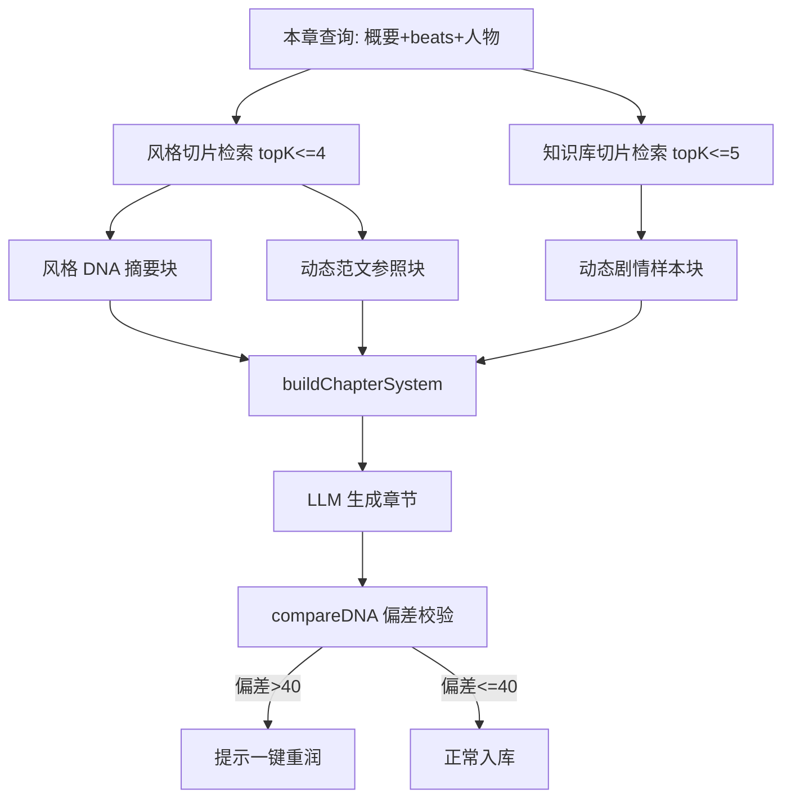

# 技术设计：风格库与知识学习库引擎升级

Feature Name: style-knowledge-engine-v2
Updated: 2026-08-29

## Description

在保持现有生成主链路结构不变的前提下，将风格库与知识学习库升级为「结构化样本库 + 按场景动态召回 + 量化校验」体系：

1. 风格分析时生成量化风格 DNA（复用 offline_learn 统计引擎），全书文本切片入库并由 LLM 打场景标签
2. 知识库学习时对样本逐块打场景标签，建立可检索的场景样本库
3. 章节生成时按本章场景/剧情动态召回风格范文片段与知识库参考片段（替代固定取样）
4. 章节生成完成后自动校验成章与目标风格 DNA 的偏差分，超阈值支持一键重润

关键决策（已与用户确认）：
- 打标方式：LLM 打标为主
- 召回策略：风格 + 知识库都召回，token 上限分开控制
- 校验接入：自动校验 + 手动重润

## Architecture

### 学习流程（风格库 / 知识库共用骨架）


### 生成流程注入



## Components and Interfaces

### 1. 新模块 `server/src/style_dna.js`

- `computeStyleDNA(text)` — 调用 `offline_learn.js` 的统计引擎（拆出 `analyzeStats(text)` 纯统计函数供复用），返回归一化 DNA 对象：
  ```js
  {
    avg_sentence_length, short_sentence_ratio, long_sentence_ratio,
    dialogue_ratio, avg_paragraph_length, comma_period_ratio,
    exclaim_ratio, question_ratio, ellipsis_per_1k,
    action_words_per_1k, emotion_words_per_1k, sensory_words_per_1k,
    top_words: [..10], paragraph_rhythm: {...}
  }
  ```
- `compareDNA(target, actual)` — 各维度相对偏差加权求和，返回 `{ score(0-100), details: [{dim, target, actual, deviation}] }`；维度权重：句长/对话占比/段落节奏 0.2，标点与词汇密度 0.1
- `mergeDNA(list)` — 多风格 DNA 按样本量加权融合
- `formatDNABlock(dna)` — 紧凑数值注入块（≤300 字）
- `analyzeStats(text)` 从 `offline_learn.js` 拆出导出，`offlineAnalyzeStyle` 内部复用，避免统计逻辑重复

### 2. 新模块 `server/src/slice_store.js`

- `sliceText(text, {minLen=500, maxLen=2000, limit=2000})` — 按段落聚合切片，返回 `[{slice_index, text}]`；超长文本按开头 40%/中间 30%/结尾 30% 抽样以满足 limit
- `saveStyleSlices(styleId, slices)` — 写 `style_slices` 表（先删后插）
- `retrieveFromSlices(table, ids, query, {topK, sceneTags, maxChars})` — 通用切片检索：
  1. 按 ids 取候选切片（含 keywords 列）
  2. 复用 rag.js 导出的 `buildTfIdf` / `cosineSim`（需从 rag.js 导出 `tokenize`、`buildTfIdf`、`cosineSim` 三个纯函数）
  3. 若指定 sceneTags：先按标签过滤再打分，结果不足 topK 时用全量补齐
  4. 返回按相关度排序且总量 ≤ maxChars 的切片
- 检索缓存：`Map<cacheKey, index>`，key = `${table}:${ids.sort().join(',')}:${count}`，与 rag.js `_indexCache` 模式一致
- `getNovelStyleSnippets(styleIds, query, opts)` / `getNovelKnowledgeSnippets(corpusIds, query, opts)` — 供 routes.js 调用的高层封装，内部处理回退逻辑

### 3. LLM 打标（prompts.js 新增）

`SCENE_TAG_SYSTEM`：输入 5 个切片片段，输出 JSON 数组，每项 `{index, scene_tags: [..1-3 个], narrative: "视角", emotion: "情绪走向"}`。场景标签固定枚举：`对话、动作/打斗、心理、环境、开篇、悬念/转折、日常、情绪高潮`。

打标执行器 `tagSlicesRateLimited`：复用 routes.js 现有 `analyzeChunksRateLimited` 的限速/重试骨架（每批 5 片，maxTokens 800），抽取为共享函数或按同模式新建。

### 4. 数据模型（db.js）

```sql
CREATE TABLE IF NOT EXISTS style_slices (
  id INTEGER PRIMARY KEY AUTOINCREMENT,
  style_id INTEGER NOT NULL REFERENCES styles(id) ON DELETE CASCADE,
  slice_index INTEGER NOT NULL DEFAULT 0,
  text TEXT NOT NULL DEFAULT '',
  scene_tags TEXT DEFAULT '',
  keywords TEXT DEFAULT '',
  created_at TEXT DEFAULT (datetime('now','localtime'))
);
CREATE INDEX IF NOT EXISTS idx_style_slices ON style_slices(style_id);
```

ensureColumn 增量迁移（沿用现有模式，兼容旧库）：
- `styles` + `style_dna TEXT DEFAULT ''`
- `knowledge_samples` + `scene_tags TEXT DEFAULT ''`、`keywords TEXT DEFAULT ''`
- `knowledge_corpora` + `tag_status TEXT DEFAULT ''`
- `chapters` + `style_deviation INTEGER DEFAULT NULL`

### 5. routes.js 改造点

| 位置 | 改造 |
|------|------|
| `POST /styles`（L4425） | 现有分析完成后追加：切片入库 → 规则预分类 → 异步 LLM 打标 → DNA 计算存 `styles.style_dna`；SSE 增加打标/ DNA 阶段进度；同步等待打标完成（前端已有进度条） |
| `POST /knowledge/import`（L5212） | 样本入库后同上追加打标（更新 `tag_status`）；LLM 学习失败时规则标签仍生效 |
| 新增 `POST /knowledge/corpora/:id/retag`、`POST /styles/:id/retag` | 手动重新打标 |
| 新增 `GET /styles/:id/slices?tag=`、`GET /knowledge/corpora/:id/slices?tag=` | 按标签浏览切片（复用现有 samples 端点语义扩展） |
| 章节生成（L2622 附近） | `knowledgeSamples` 替换为 `getNovelKnowledgeSnippets(knowledgeIds, chapterQuery, {topK:5, maxChars:4000})`；新增 `styleSnippets = getNovelStyleSnippets(styleIds, chapterQuery, {topK:4, maxChars:3000})`；查询串 = 本章概要 + beats 场景描述 + 出场人物名 |
| `buildChapterSystem` 调用（L2836/2840） | opts 新增 `styleSnippets`（动态范文参照块）与 `styleDNA`（DNA 摘要块），注入位置在现有「真人文风参照」之前；召回为空时走现有 `novel.style_samples` 回退 |
| `buildPolishSystem` / `buildReviseSystem`（L3814/3872） | opts 同样透传 `styleSnippets` / `styleDNA` |
| 章节落库点（ai_score 写入附近） | 启用风格有 DNA 时自动 `compareDNA`，写 `chapters.style_deviation`；SSE 发送 `{type:'style_deviation', score, details}`；偏差 > 40 时附带提示消息 |
| 新增 `POST /chapters/:id/polish-by-dna` | 按偏差明细构造润色指令（「平均句长偏长 35%，请增加短句」式具体要求），走现有 polish 流程 |

### 6. 前端改造点

| 文件 | 改造 |
|------|------|
| `StyleLibrary.vue` | 详情页新增：DNA 数值卡片区（句长/对话占比/段落节奏等）、样本切片浏览（标签筛选 chips）、重新打标按钮 |
| `KnowledgeBase.vue` | 详情页新增：场景标签分布统计、切片标签浏览 |
| `ChapterArea.vue` / 检测展示区 | 风格偏差分徽标（与 AI 味评分并列）+ 「按风格 DNA 重润」按钮 + 偏差维度明细弹层 |
| `web/src/api/index.js` | 新增 slices/retag/polish-by-dna 接口封装 |
| `stores/editor.js` | 接收 `style_deviation` SSE 事件并存状态 |

## Data Models

核心新数据结构见上文。存量数据兼容策略：
- 旧 styles / knowledge_corpora 无切片与 DNA：检索高层封装返回空 → 生成链路自动回退现有固定注入；详情页显示「未建立画像」引导重新分析
- 旧 chapters 无 style_deviation：列默认 NULL，UI 显示「未校验」

## Correctness Properties

1. 召回注入总量有硬上限：风格 ≤3000 字、知识 ≤4000 字，拼接截断在 maxChars 内完成
2. 检索与打标的任何异常（空库/LLM 失败/超时）均回退到现有固定注入路径，生成主流程永不因新模块失败而中断
3. `style_deviation` 与 `ai_score` 相互独立，互不覆盖
4. 切片上限：单风格 ≤2000 片、单语料切片沿用现有 30 段限制扩展为 ≤2000 片
5. 打标失败切片 scene_tags 保留规则预分类结果（可能为空），status 不影响综合报告

## Error Handling

| 场景 | 处理 |
|------|------|
| LLM 打标批量失败（重试后仍失败） | 已打标部分生效，corpus.tag_status = 'partial'，前端提供 retag 重试入口 |
| 检索表为空 / query 为空 | 返回空数组，routes.js 走回退注入 |
| TF-IDF 索引构建异常（内存等） | try/catch 包裹，降级为按 slice_index 顺序取样 |
| DNA 计算异常 | style_deviation 写 NULL，SSE 不发偏差事件 |
| 切片总量超限 | sliceText 按 40/30/30 抽样截断 |

## Test Strategy

后端 `node --test`（沿用现有 test/ 目录模式）：
- `test/style_dna.test.js` — computeStyleDNA 对构造文本的数值正确性（句长/对话占比）；compareDNA 偏差方向与边界（完全一致=0 分、极端偏差上限）；mergeDNA 加权
- `test/slice_retrieve.test.js` — sliceText 边界（空文本/超短文本/超限抽样）；TF-IDF 检索相关性（含目标词切片应排前）；sceneTags 过滤与补齐逻辑；maxChars 截断
- `test/rate_limit.test.js` 等现有测试回归

手工验证路径：
1. 导入 5 万字小说到风格库 → 观察 SSE 阶段进度 → 详情页出现 DNA 卡片与切片浏览
2. 新建小说启用该风格，生成第 1 章 → 检查服务端日志中注入的范文片段与本章场景相关 → 章节列表出现风格偏差分
3. 无 LLM 配置（离线模式）→ 导入知识库 → 规则预分类标签生效，学习不报错
