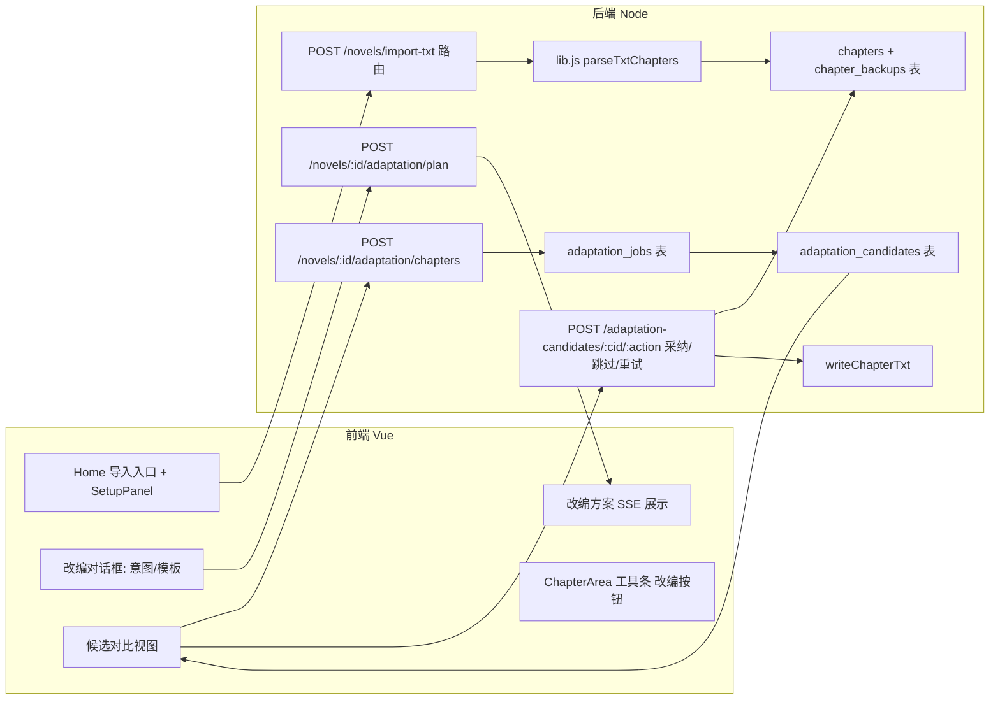

# TXT Import and Adaptation

Feature Name: txt-import-and-adaptation
Updated: 2026-08-11

## Description

为 AI 小说工坊新增两条能力线：

1. **TXT 导入**：用户把已有小说的 `.txt` 文件导入，系统解析为章节，作为一本全新小说落库（novel 行 + chapters 行 + TXT 副本），成为后续改编的底稿。
2. **整本改编**：用户发起改编时，系统先询问改编意图（自由文本或预设模板），生成逐章的「改编方案」供确认；确认后按 `chapter_index` 升序**逐章**由 AI 重写。每章结果写入**候选章节**（不动正式表），前端展示候选 vs 原始对比视图，用户「采纳 / 跳过 / 重试」后处理下一章。改编任务持久化（`adaptation_jobs` 表），切书/刷新可恢复进度。

改编遵循与现有修订一致的原则：覆盖前 `backupChapter` 备份、注入「不可变锚点」防止乱改名/主线错位、滚动采纳摘要保证连贯性。

## Architecture

改编任务链路：用户发起 → 改编对话框收集意图 → `POST adaptation/plan` 生成方案（SSE）→ 用户确认 → `POST adaptation/chapters` 逐章生成候选（SSE，按章推进）→ 每章出候选 → 前端对比视图 → 采纳写正式章节 + TXT 副本。

## Components and Interfaces

### 后端

**db.js 新增 2 张表**（沿用 `CREATE TABLE IF NOT EXISTS` + `ensureColumn` 风格）：

- `adaptation_jobs`：整本改编任务主记录。
  `id, novel_id, intent, plan, status('drafting_plan'|'plan_ready'|'adapting'|'done'|'aborted'), current_index, total_chapters, accepted_count, skipped_count, failed_count, error, created_at, updated_at`
- `adaptation_candidates`：单章候选。
  `id, novel_id, job_id, chapter_index, original_title, original_content, candidate_title, candidate_content, status('pending'|'accepted'|'skipped'|'failed'|'retrying'), error, created_at`
  唯一索引 `(job_id, chapter_index)`，保证每任务每章最多一个候选行。

**新增 lib.js 函数**：

- `parseTxtChapters(text)`：解析 TXT 为 `[{ title, content }]` 数组。按 `第X章` 行首（支持 一二三/1-9/壹贰叁/章节卷，正则 `^\s*(第[0-9一二三四五六七八九十百千万零]+[章回节卷]|[0-9]+[.\、]\s*)`）分割；无标题则按每 2000 字切分并返回 `splitted=true` 标记。

**新增 routes.js 路由**（全部按现有 `startSSE` + `tryCreateJob` 模式）：

| 方法 | 路径 | 说明 |
|------|------|------|
| POST | `/novels/import-txt` | 接收 `{ title, content }`，`parseTxtChapters` 解析后建 novel + 批量插入 chapters，逐章 `writeChapterTxt`，返回 `{ novel }`。不建 Job（导入快），失败回滚已建行。 |
| POST | `/novels/:id/adaptation/plan` | 接收 `{ intent }`；建 `adaptation_jobs`（status=`drafting_plan`）；SSE 流式生成改编方案 JSON（复用 `runLLMStream` + 强化 `jsonFrom` 提取），完成后 status=`plan_ready`，返回方案。 |
| POST | `/novels/:id/adaptation/start` | 接收 `{ plan }`（用户在方案确认后提交）；置 job status=`adapting`，`current_index=0`；逐章调度。 |
| POST | `/novels/:id/adaptation/next` | 处理当前章：取该章原文 + 意图 + 方案该章要点 + 前 N 章已采纳摘要，`runLLMStream` 生成候选，写入 `adaptation_candidates`，返回候选；成功则推进 `current_index` 并更新进度（`(current+1)/total`）。 |
| POST | `/adaptation-candidates/:cid/accept` | 采纳：`backupChapter` → 覆盖 `chapters` 表（title/content/word_count）→ `writeChapterTxt` → 更新摘要 → 候选 status=`accepted`，`accepted_count+1`。 |
| POST | `/adaptation-candidates/:cid/skip` | 候选 status=`skipped`，`skipped_count+1`，返回 `{ ok }`。 |
| POST | `/adaptation-candidates/:cid/retry` | 候选 status=`retrying`，重新 `runLLMStream` 生成并刷新候选内容。 |
| GET | `/novels/:id/adaptation` | 返回当前 job（含全部候选），供刷新/切书后恢复进度。 |

**提示词（prompts.js 新增）**：

- `ADAPTATION_PLAN_SYSTEM`：把意图展开为逐章改造要点，输出 `{"chapters":[{"chapter_index":1,"title":"...","actions":["..."]}],"global_notes":"..."}`。
- `ADAPTATION_CHAPTER_SYSTEM`：要求基于原文改写、保留剧情骨架与角色名（除非意图明确要求），注入「不可变锚点」（角色名清单 + 关键剧情点 + 新旧人名映射表）。

### 前端

- **stores/editor.js 新增 action**：
  - `importTxt({ title, content })`：POST `/novels/import-txt`，成功后切到新小说并 `refresh()`。
  - `adaptationPlan(intent)`：调 `/adaptation/plan`（streamRequest），接收 progress/delta，产出方案文本。
  - `adaptationStart(plan)`、`adaptationNext()`、`acceptCandidate(cid)`、`skipCandidate(cid)`、`retryCandidate(cid)`、`loadAdaptation()`。
  - state 增加 `adaptation` 切片（job + candidates + currentIndex），纳入现有 `_commit`/slice 多书机制。
- **api/index.js**：新增对应方法（复用 `streamRequest`）。
- **Home.vue / SetupPanel.vue**：新增「导入 TXT」入口（文件选择，仅 `.txt`，读为文本提交）。
- **ChapterArea.vue**：章节工具条新增「改编」按钮，打开改编对话框；渲染当前章候选对比视图（用项目已有 `diff` 依赖做增/删/改高亮）。
- **AdaptDialog.vue（新组件）**：改编对话框——文本域（自定义意图）+ 模板下拉（改成爽文 / 主角换性别 / 改为悲剧结局 / 节奏加快 / 世界观更换）；确认后展示改编方案（SSE 流式）。

## Data Models

- **chapters 表**：保持现有结构不变。候选采纳时仅 `UPDATE` 该行（title/content/word_count/updated_at）。
- **chapter_backups 表**：复用现有表，采纳覆盖前 `backupChapter(novelId, idx, '改编')`。
- **adaptation_jobs**：见 db.js 节。`plan` 存改编方案 JSON 文本；`total_chapters` 初始化为当前章节总数；`current_index` 为已出候选的最大章号。
- **adaptation_candidates**：`original_*` 为导入/当前正式内容快照，`candidate_*` 为 AI 输出。对比视图直接取两者 diff。

## Correctness Properties

1. 逐章改编按 `chapter_index` 升序推进，同一 `adaptation_jobs` 下每章候选唯一（唯一索引 `(job_id, chapter_index)`）。
2. 候选采纳前，正式 `chapters` 表内容不发生变化（REQ-03 候选隔离）。
3. 采纳覆盖前必须 `backupChapter`，保证任何改编可回退（REQ-01 AC6 / REQ-03 AC4）。
4. 同一小说同一阶段（plan 生成中或 adapting 中）再次发起改编，`tryCreateJob` 冲突拒绝，返回 409（REQ-04 AC3）。
5. 连续章节上下文：第 N 章提示词注入「已采纳前 M 章摘要」滚动窗口；人名替换时注入新旧映射表（REQ-05）。
6. `current_index` / `accepted_count` / `skipped_count` / `failed_count` 之和始终与已处理章节状态一致；任务 done 时全部章节非 `pending`。

## Error Handling

| 场景 | 处理 |
|------|------|
| TXT 解析无章节标题 | 按字数切分，返回 `splitted=true` 前端提示（REQ-01 AC3） |
| 导入中途 DB 异常 | 事务回滚，删除已建 novel 行，返回可读错误（REQ-01 AC5） |
| 改编方案 JSON 解析失败 | 复用强化版 `extractJson`/`jsonFrom`；失败一次即告知用户可重试，不无界重试（沿用现有 revise 策略） |
| 某章改编失败 | 候选 status=`failed`，`failed_count+1`，任务不中断；用户可对该章「重试」（REQ-03 AC7） |
| SSE 连接断开 | Job 持久化，前端 `loadAdaptation()` 恢复；`res close` 时 `ctrl.abort()`（沿用 `startSSE` 机制） |
| 用户中止 | 改编对话框取消：不建 job；进行中中止：job status=`aborted`，已产生的候选保留（REQ-02 AC5） |

## Test Strategy

1. **单元测试（parseTxtChapters）**：`第X章` 分割 / 中文数字章号 / `第一章`+空行混合 / 无标题按字数切分 / 超大 TXT（>100 章）性能。
2. **e2e（mock LLM）**：参照 `/tmp/opencode/e2e-jobs.mjs` 模式，用 mock-llm 串流返回固定 JSON：
   - 导入 → GET 小说 → 章节数正确、每章 `word_count` 非 0、TXT 副本文件存在。
   - 改编 plan → 方案 JSON 落库 → start → next 逐章出候选 → accept 后正式章节被覆盖且 `chapter_backups` 有快照 → skip 保留原文 → retry 刷新候选。
   - 冲突：任务进行中再次 start 返回 409。
   - 恢复：任务中断后 `GET /adaptation` 返回 job + 候选，前端可续。
3. **前端**：`npm run build` 通过；对比视图 diff 正确渲染（候选 vs 原始增/删/改高亮）。
4. **打包回归**：`node --check` + `prepare-deps.cjs` + win/linux 打包 smoke（仅验证能启动，改编 e2e 用 mock）。

## References

[^1]: (routes.js#L91) - [startSSE 机制](server/src/routes.js)
[^2]: (routes.js#L350) - [POST /novels 新建小说路由](server/src/routes.js)
[^3]: (routes.js#L320) - [backupChapter 备份函数](server/src/routes.js)
[^4]: (routes.js#L1012) - [POST /novels/:id/chapters/generate 章节生成路由（SSE+Job+续写模式参考）](server/src/routes.js)
[^5]: (routes.js#L225) - [runLLMStream 封装](server/src/routes.js)
[^6]: (db.js#L156) - [chapter_backups 表](server/src/db.js)
[^7]: (db.js#L210) - [generation_jobs 表](server/src/db.js)
[^8]: (storage.js#L72) - [writeChapterTxt 同步副本函数](server/src/storage.js)
[^9]: (web/src/components/ChapterArea.vue#L353) - [章节工具条（改编按钮入口）](web/src/components/ChapterArea.vue)
